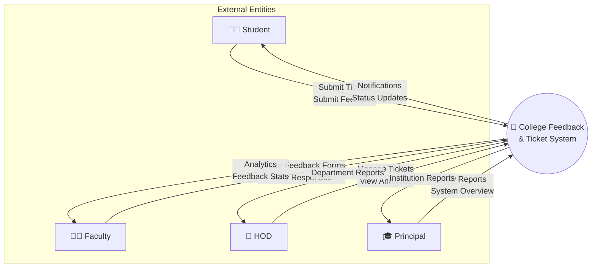
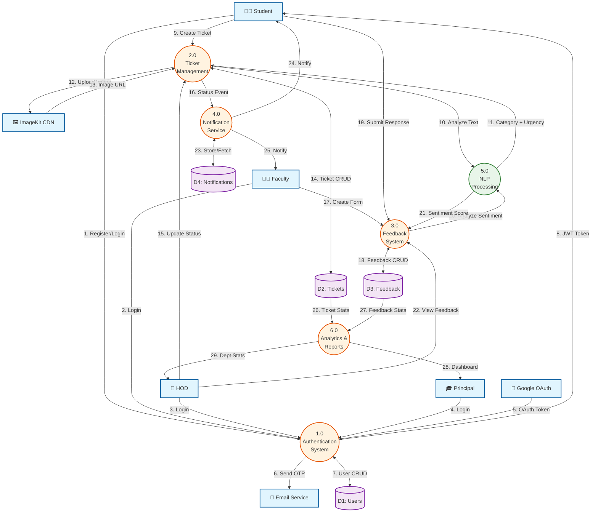
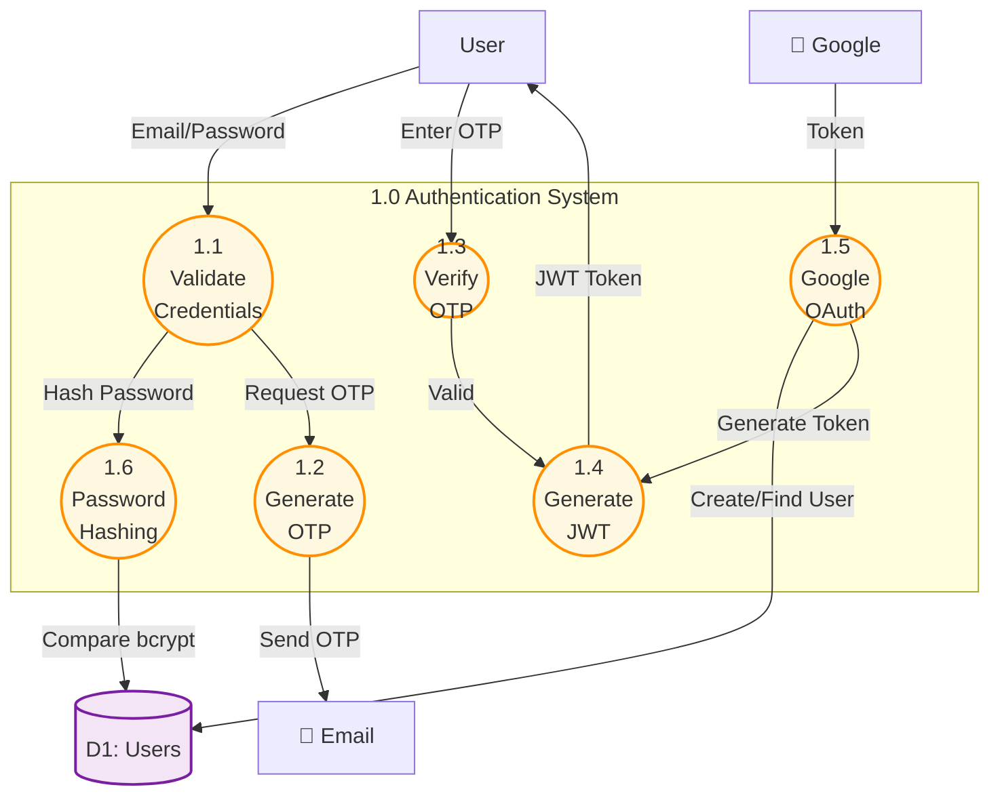
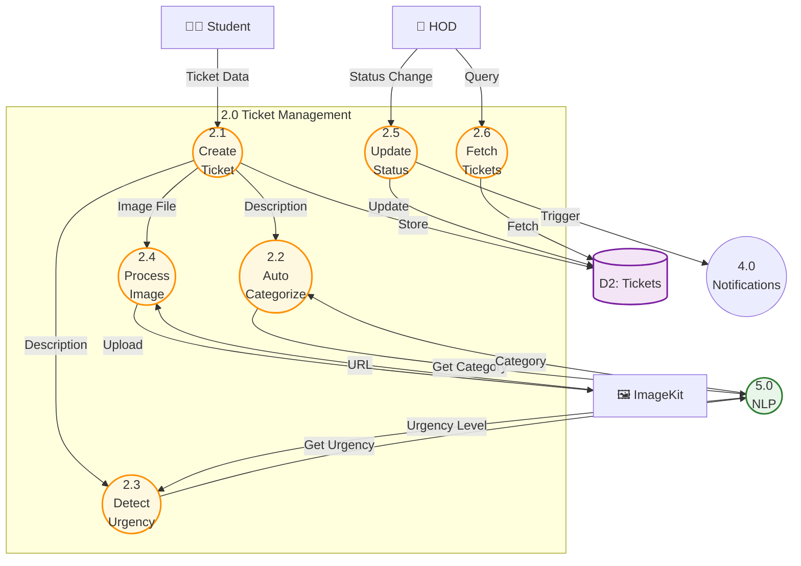
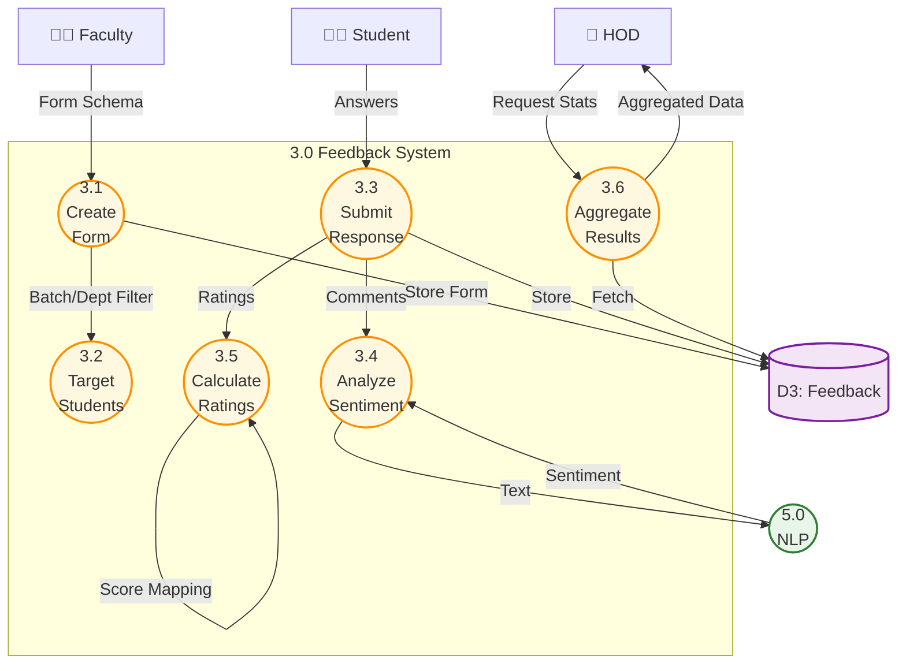
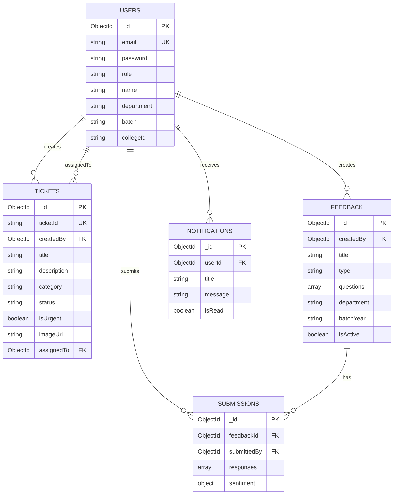
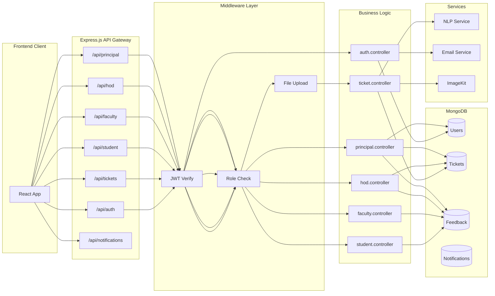

# Data Flow Diagram - College Feedback & Ticket System

## Level 0 - Context Diagram



## Level 1 - Detailed Data Flow Diagram



## Level 2 - Authentication Process (P1) Decomposition



## Level 2 - Ticket Management (P2) Decomposition



## Level 2 - Feedback System (P3) Decomposition



## Data Store Schema



## API Endpoints Data Flow



---

## How to View This Diagram

1. **VS Code**: Install "Markdown Preview Mermaid Support" extension
2. **GitHub**: Push this file to GitHub - it renders Mermaid automatically
3. **Online**: Copy the Mermaid code blocks to [mermaid.live](https://mermaid.live)
4. **Export**: Use mermaid-cli to export as PNG/SVG:
   ```bash
   npm install -g @mermaid-js/mermaid-cli
   mmdc -i dataflow-diagram.md -o dfd.png
   ```

---
Generated on: 2026-03-24T07:48:22.843Z
