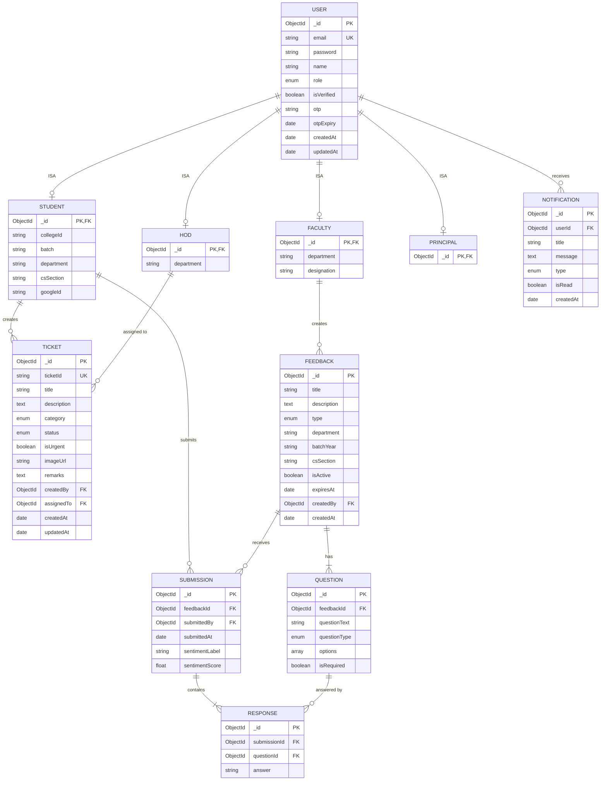

# ER Diagram - Chen's Notation Reference

> **Note:** Mermaid doesn't support true Chen's notation. Use the Graphviz DOT file for proper Chen's notation.
> This Mermaid diagram shows the same relationships in Crow's Foot notation for quick reference.

## Crow's Foot Notation (Mermaid)



## Chen's Notation Legend

| Symbol | Meaning |
|--------|---------|
| Rectangle | Strong Entity |
| Double Rectangle | Weak Entity |
| Ellipse | Attribute |
| Underlined Ellipse | Key Attribute |
| Double Ellipse | Multivalued Attribute |
| Dashed Ellipse | Derived Attribute |
| Connected Ellipses | Composite Attribute |
| Diamond | Relationship |
| Double Diamond | Identifying Relationship |
| Triangle | Specialization/Generalization (ISA) |
| 1, N, M | Cardinality |
| Single Line | Partial Participation |
| Double Line | Total Participation |

## How to Render the Chen's Notation Diagram

The `er-diagram-chen.dot` file contains the full Chen's notation diagram.

```bash
# Install Graphviz if not already installed
# Ubuntu/Debian
sudo apt install graphviz

# macOS
brew install graphviz

# Windows (with chocolatey)
choco install graphviz

# Render to PNG
dot -Tpng er-diagram-chen.dot -o er-diagram-chen.png

# Render to SVG (scalable)
dot -Tsvg er-diagram-chen.dot -o er-diagram-chen.svg

# Render to PDF
dot -Tpdf er-diagram-chen.dot -o er-diagram-chen.pdf
```

---
Generated on: 2026-03-24T08:18:27.669Z
